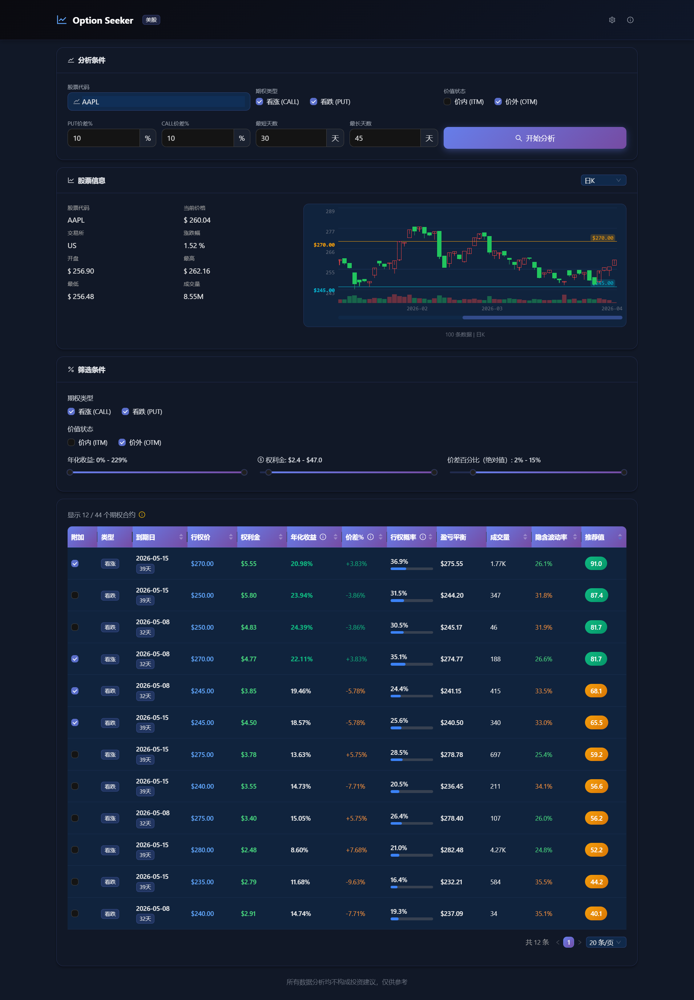

# Option Seeker - 美股期权分析平台

一个现代化的美股期权筛选与多维度量化分析平台，帮助投资者快速找到符合筛选条件的期权合约。

A modern US stock options screening and multi-dimensional quantitative analysis platform.



## 功能特点

- **实时行情** - 通过长桥券商 API 获取美股实时报价与期权链数据
- **多维度筛选** - 按年化收益率（卖方）、权利金、价差百分比（绝对值）、到期天数、期权类型（Call/Put）、价值状态（ITM/OTM）灵活筛选
- **智能推荐** - 综合年化收益（卖方）、行权概率、价差、成交量等因素计算推荐分数
- **K线图表** - 支持多种周期（1分钟/5分钟/15分钟/30分钟/60分钟/日/周/月）的 K 线走势查看
- **ITM 概率分析** - 基于 Black-Scholes 模型计算期权到期时处于价内的概率
- **盈亏平衡点计算** - 自动计算看涨/看跌期权的盈亏平衡价格
- **暗色主题** - 现代化暗色模式界面设计，保护眼睛

## 目录结构

```
option-seeker/
├── backend/
│   ├── main.py              # FastAPI 入口
│   ├── requirements.txt     # Python 依赖
│   ├── models/              # 数据模型
│   ├── routers/             # API 路由
│   └── services/            # 业务逻辑（期权分析）
├── frontend/
│   ├── src/
│   │   ├── components/      # React 组件
│   │   ├── services/        # API 调用
│   │   └── types/           # TypeScript 类型
│   └── package.json
└── README.md
```

## 长桥券商配置

本项目使用[长桥证券 OpenAPI](https://open.longportapp.com/)获取美股期权数据（国内用户可访问 [open.longportapp.cn](https://open.longportapp.cn/)）。

### 1. 开通权限

- 长桥证券账户（支持港美股）
- 开通「美股期权」OpenAPI 权限
  - 登录 [长桥开放平台](https://open.longportapp.com/)（国内用户可访问 [open.longportapp.cn](https://open.longportapp.cn/)）
  - 进入「我的 API」→「权限管理」
  - 申请开通 US Option 相关权限

### 2. 配置环境变量

**Windows 用户**（推荐通过「计算机属性」→「环境变量」配置）：

```
LONGPORT_APP_KEY=your_app_key
LONGPORT_APP_SECRET=your_app_secret
LONGPORT_ACCESS_TOKEN=your_access_token
LONGPORT_REGION=cn          # 可选: cn, hk
LONGPORT_ENABLE_OVERNIGHT=true  # 可选: true, false
```

**Linux / macOS 用户**：

```bash
export LONGPORT_APP_KEY="your_app_key"
export LONGPORT_APP_SECRET="your_app_secret"
export LONGPORT_ACCESS_TOKEN="your_access_token"
export LONGPORT_REGION="cn"          # 可选: cn, hk
export LONGPORT_ENABLE_OVERNIGHT="true"  # 可选: true, false
```

## 环境要求

- **Python**: >= 3.7
- **Node.js**: >= 18

## 安装与启动

### 1. 启动后端

```bash
cd backend
pip install -r requirements.txt
python -m uvicorn main:app --host 127.0.0.1 --port 8000
```

### 2. 启动前端

```bash
cd frontend
npm install
npm run dev
```

前端启动后访问 http://localhost:3000

## 核心指标说明

| 指标 | 说明 |
|------|------|
| **年化收益率（卖方）** | 卖出期权时，基于权利金与持有期计算的年化收益百分比。公式：(1 + 权利金/行权价)^(365/到期天数) - 1 |
| **行权概率 (ITM)** | 期权到期时处于价内（实值）的概率，基于 Black-Scholes 模型 |
| **价差百分比** | 当前股价与行权价的差距百分比（绝对值），行权价低于当前价显示负值，高于显示正值 |
| **权利金** | 期权当前市场价格 |
| **盈亏平衡** | 期权到期时刚好回本的标的股价 |
| **隐含波动率 (IV)** | 市场对未来波动率的预期 |
| **推荐值** | 综合年化收益率（卖方）、ITM 概率、价差、流动性计算的推荐分数 |

## 使用限制

- 由于券商 API 频率限制，部分远期期权合约可能未返回，请缩小筛选范围后重试
- 数据存在一定延迟，不构成投资建议
- 仅供学习研究使用，投资有风险

## License

MIT
